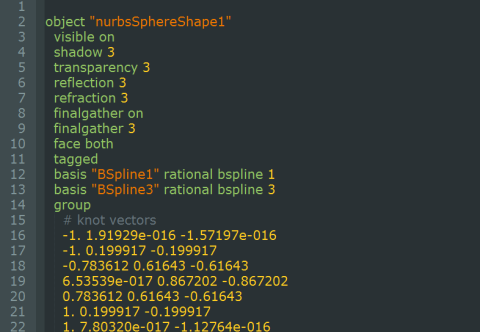
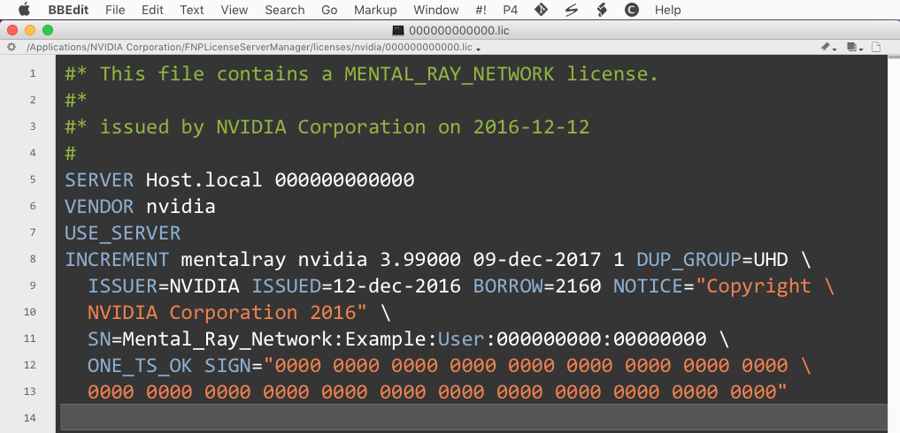

# mental ray Syntax Highlighter #

**Version 1.1** Released December 12, 2016  
by Andrew Hazelden

## Overview ##

This collection of [mental ray](http://www.nvidia.com/object/nvidia-mental-ray-products.html) syntax highlighting modules work with Notepad++, BBEdit, and TextWrangler. The modules make it easier for a VFX artist or technical director to edit mental ray .mi include and scene files.

*The mental ray syntax highlighters are distributed under a GPL v3 license.*

## Wiki Documentation Quick Links ##

Check out the [Wiki index page for documentation](https://github.com/AndrewHazelden/Mental_Ray_Syntax_Highlighter/wiki) on the syntax highlighting toolset.

## Flexera FlexNet Publisher Syntax Highlighter ##

A Flexera FlexNet Publisher lmadmin and IrayLM .lic license syntax highlighter module is also included. This makes it easier to view a generated license file and edit properties like the server's hostname or other parameters when you are setting up a new floating license server.

## mental ray IDE Tools ##

In addition to the syntax highlighter modules, a suite of mental ray IDE (Integrated Development Environment) tools are provided. These scripts work with BBEdit and TextWrangler. The rendering TD centric scripts will boost your productivity when working with mental ray standalone, or mental ray for Maya.

## Notes ##

I hope this toolset improves your coding workflow as you develop new .mi files using a plain text editor.

Cheers,  
Andrew Hazelden

eMail: [andrew@andrewhazelden.com](mailto:andrew@andrewhazelden.com)   
Blog: [http://www.andrewhazelden.com](http://www.andrewhazelden.com)  
Twitter: [@andrewhazelden](https://twitter.com/andrewhazelden)  
Google+: [https://plus.google.com/u/0/+AndrewHazelden](https://plus.google.com/u/0/+AndrewHazelden)
